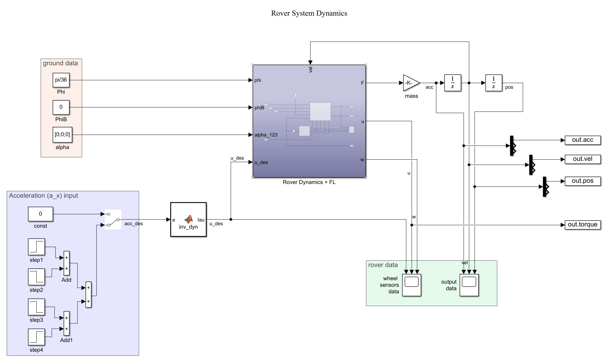
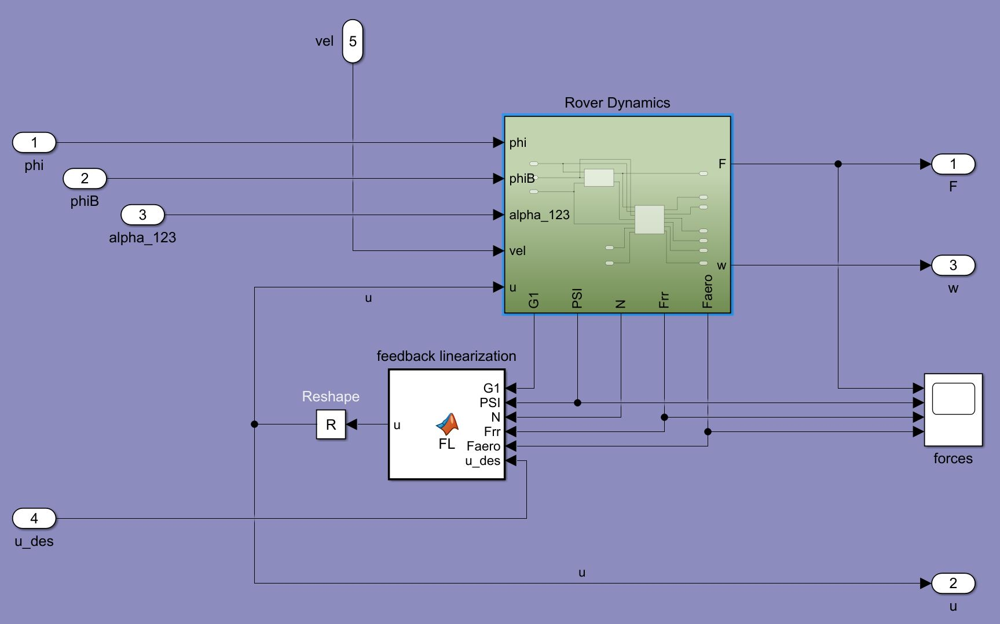
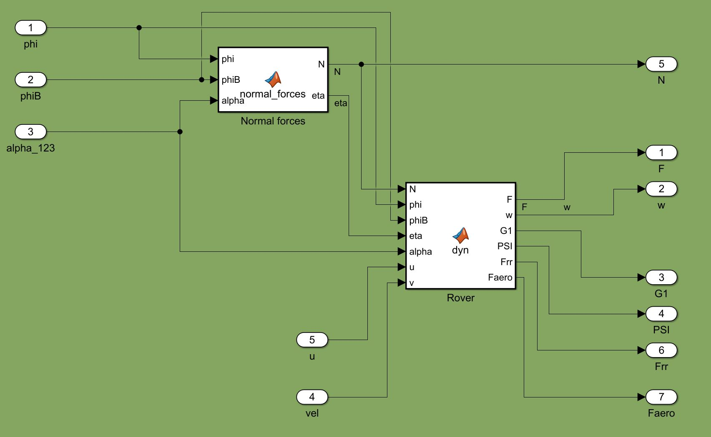
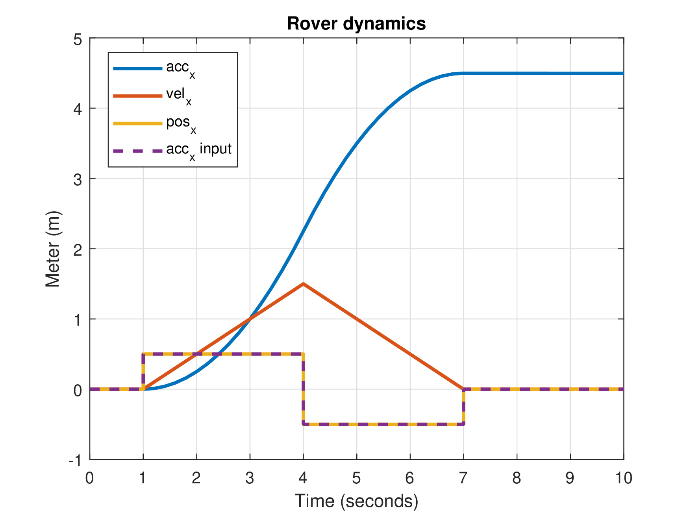
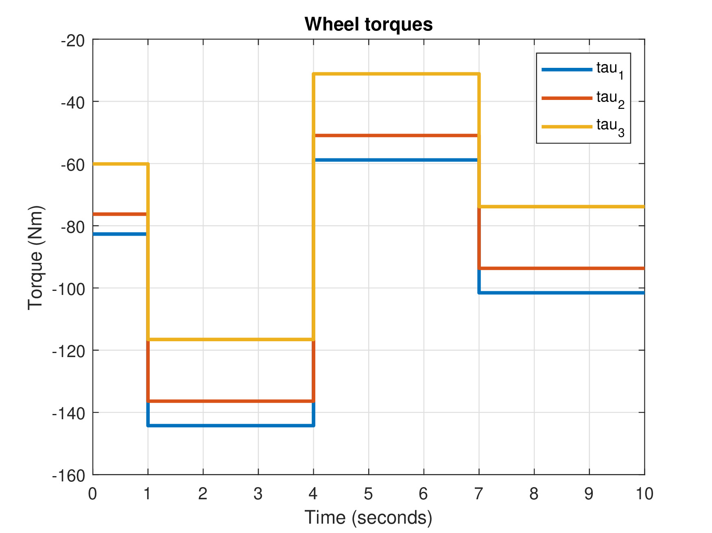

# Rover-Dynamics-and-Control

### Roadmap
- [x] Nonlinear dynamic model
- [x] Normal forces computation
- [x] Rolling resistance and aerodinamic drag
- [x] Feedback linearization
- [x] Inverse dynamics
- [x] Acceleration controlled control scheme
- [ ] Set-point regulation problem w\ bang-coast-bang
- [x] mars ground acquisition
- [ ] get ground angles in real-time 

## Table of contents
* [Project Overview](#project-overview)
* [Ground Acquisition](#ground-acquisition)
* [Control Scheme](#control-scheme)
* [Simulations](#simulations)

## Project Overview
...

## Ground Acquisition
...

## Control Scheme

## Simulations

#### Simulation 1
Bang-bang acceleration input.
- phi = pi/36 (5 degrees)
- phiB = 0
- alpha = [0; 0; 0]

